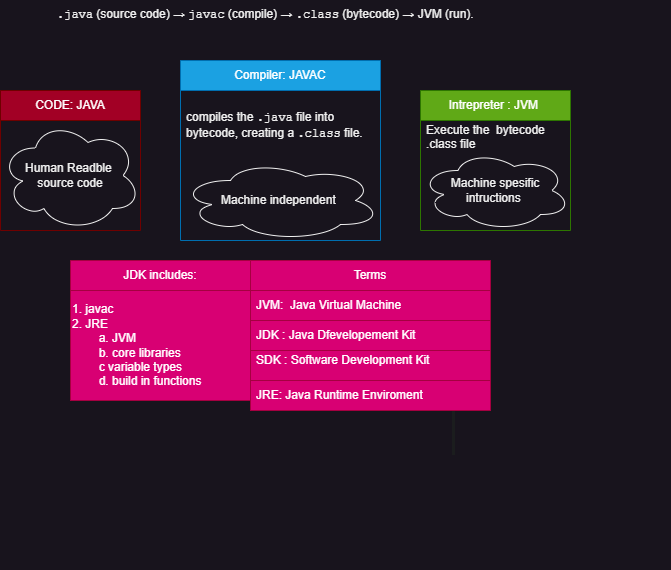
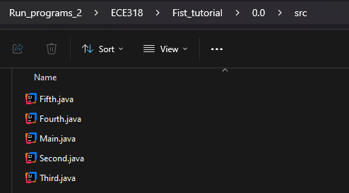
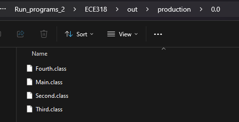
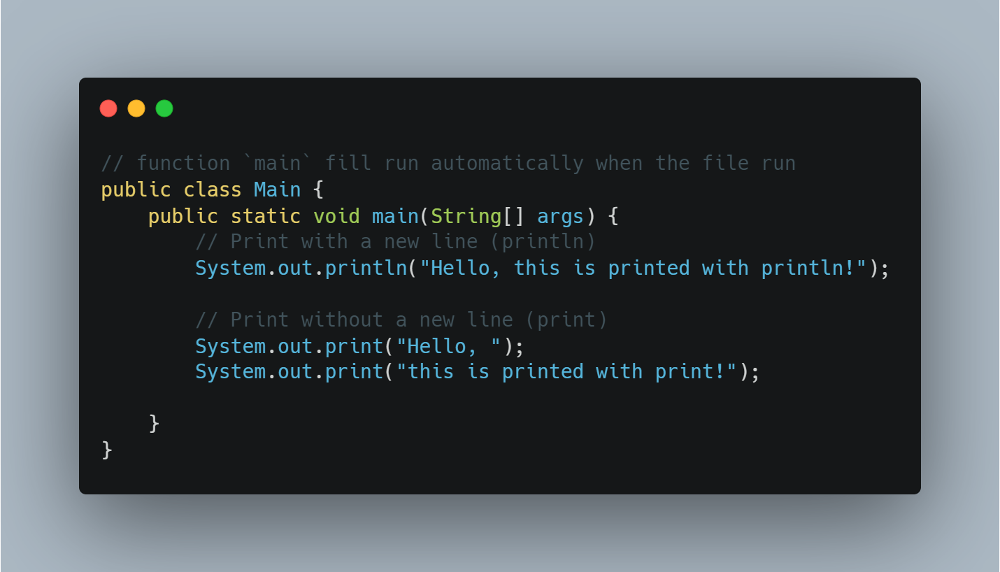
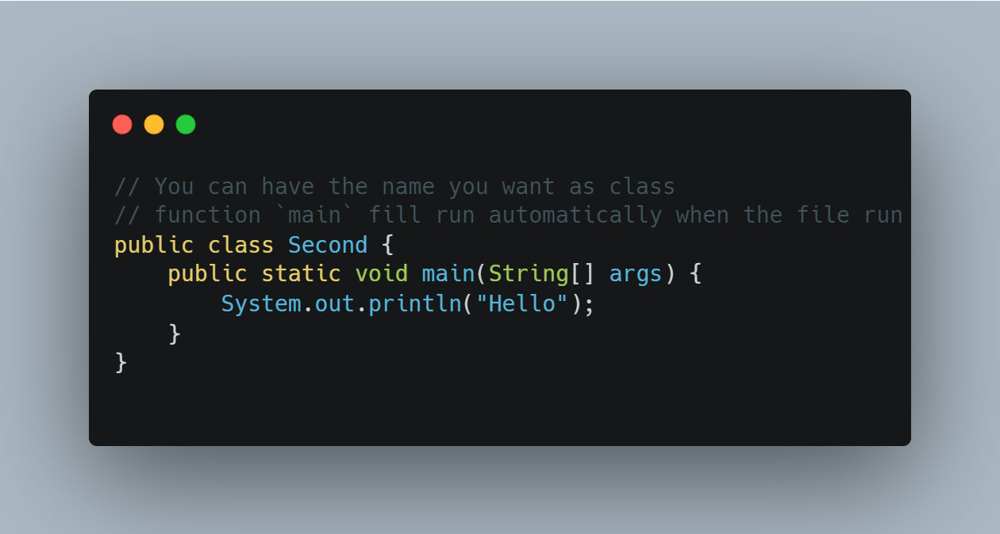
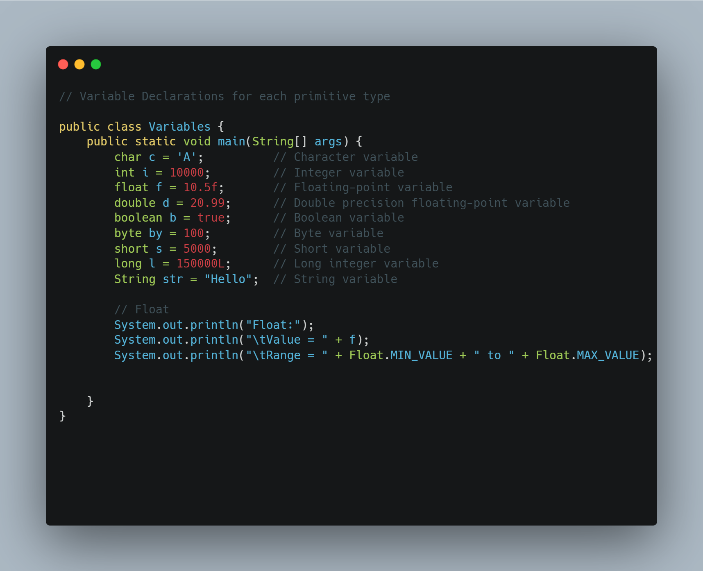
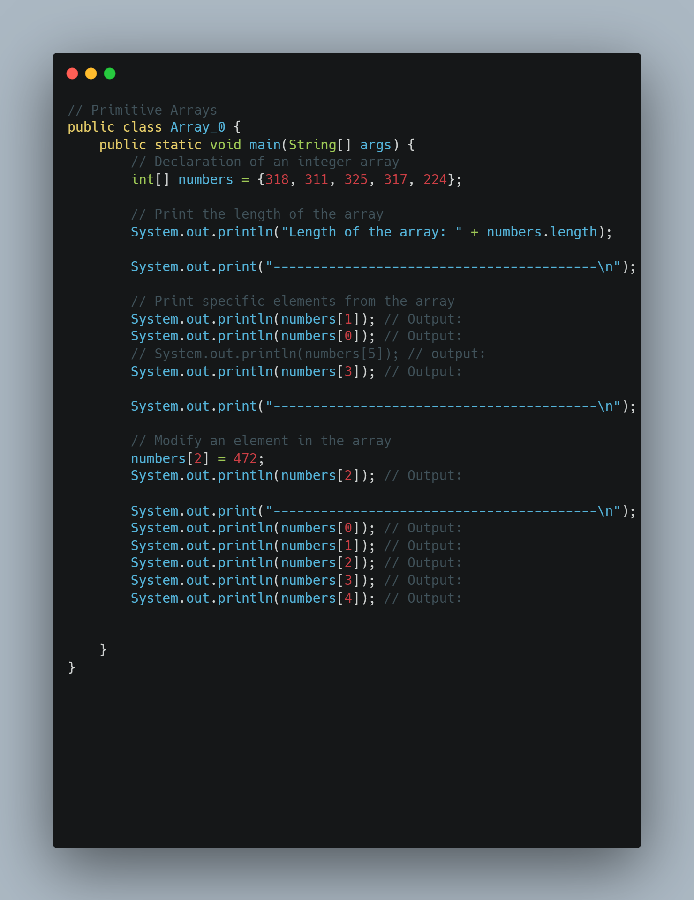
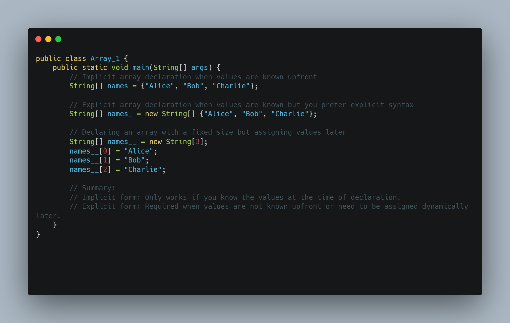
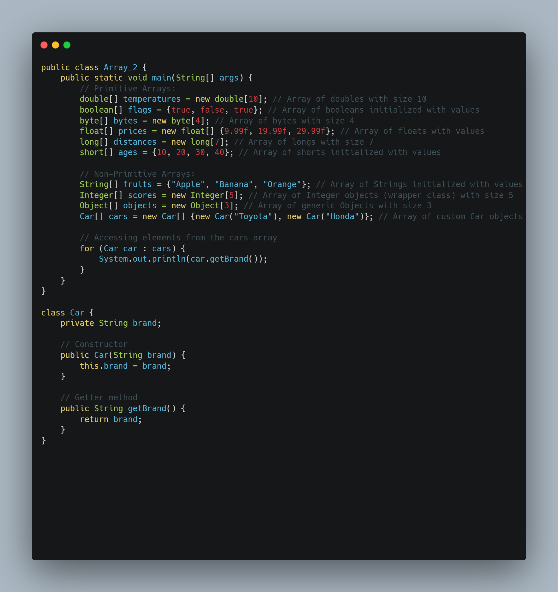
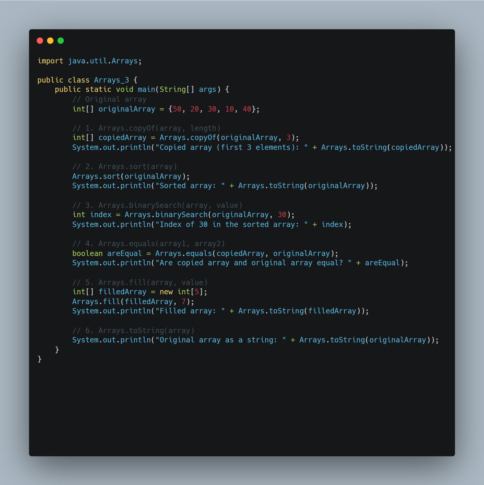

# First Tutorial

## Educational Licence 
* Open the link and fill out the form using your UCY email address
  * https://www.jetbrains.com/shop/eform/students

## Jetbrains Toolbox 
  * Download the application : https://www.jetbrains.com/toolbox-app/

## Download  Intellij IDEA Ultimate
  * Open JetBrains  Toolbox  
  * Find Intellij IDEA Ultimate and click Install
  * Activate educational licence 

## Compile and Intrepreter
* 
* 
* 

## Create a project
  * Open  Intellij IDEA Ultimate
  * Log in with UCY email
  * In the window  `Welcome to Intelij IDEA` window select `New Project`

### Setup SDK/JDK  
* The window below will appear:
    * 
 * Name your project , e.g. "First Tutorial"
 * Select a location for ECE318 projects and the specific project.
 *  Click on the JDK option and select Download JDK	
 * **Note : JDK acts as an SDK within IntelliJ.

## Setup SDK/JDK for the PC  
* Open the Environment Variables:
  * Press Windows key + S and type Environment Variables.
  * Click Edit the System Environment vVriables.

* Edit the PATH Variable:
  * In the System Properties window, click Environment Variables.
  * Under System variables, locate and select Path, then click Edit.
  * Click New and add this path:
    `C:\Users\<user_name>\.jdks\openjdk-22.0.2\bin`
  * Click OK to save and close all windows.
 

* Verify the Setup:
  * Open a new PowerShell or Command Prompt and run:
      `javac -version`

## Your First Run
* This is the structure of a project
  *  

* Click the green button to run the code:
  * 

## Examples 
* 
* 
* 
* 
* 
* 
* 

## Further Study:
* variables : https://docs.oracle.com/javase/tutorial/java/nutsandbolts/datatypes.html
* Arrays :
  * https://docs.oracle.com/javase/tutorial/java/nutsandbolts/arrays.html
  * https://www.geeksforgeeks.org/array-class-in-java/?ref=lbp
* java.util: https://docs.oracle.com/javase/8/docs/api/java/util/package-summary.html

## Your first shortcuts in Intellij IDEA Ultimate
*  Set up mouse wheel for zoom in/out:
   1. File -> project structure
      * Go to File > Settings -> Editor > General.
          - Find the section : `Mouse Control`.
          - Check the box  `Change font size (Zoom) with Ctrl+Mouse Wheel`.
          - Click Apply and then OK.
* Comments
  * `//` 
  * Ctrl + `/` -> comment a line  or multiple 
  * Ctrl + Shift + `/` -> comment with `*/`

* Add ';' in the end of a line: 
  *  Ctrl+ Shift + Enter  
 

* Close and open `Project Window `
   * Open : Alt + 1 
   * Close: Shift + Esc

* Run code 
   * Ctrl+Shift+ f10 -> run current code 
   * Fn+ Shift + f10 -> Run the last run code 
  
 
