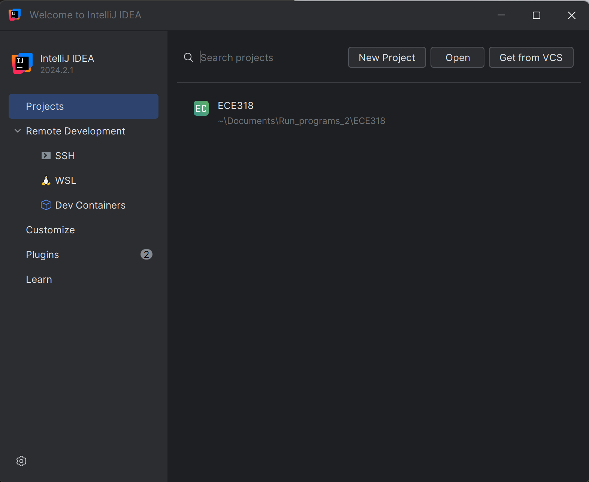
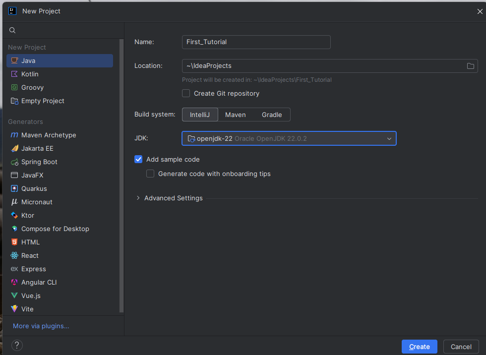
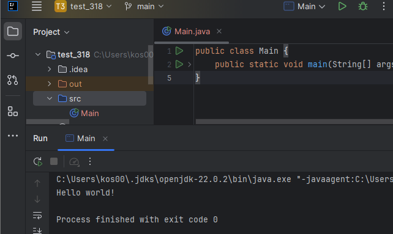

# First Tutorial

## Educational Licence 
* Open link and fill the form with UCY email 
  * https://www.jetbrains.com/shop/eform/students

## Jetbrains Toolbox 
  * Download the application : https://www.jetbrains.com/toolbox-app/

## Download  Intellij IDEA Ultimate
  * Open Jetbrains Toolbox  
  * Find Intellij IDEA Ultimate and click install 

## Create a Project
  * Open  Intellij IDEA Ultimate
  * Log in with UCY email
  * In the window  `Welcome to intelij IDEA` select `New project`

### Setup SDK  
  * will appear the windows as below 
    * 
 * Give a name to project , e.g. "First tutorial"
 * Give a location for ECE318 projects and to the spesific project 
 * in JDK option, click and select download JDK 
	**note : JDK acts as the SDK within IntelliJ.

## Your First Run 
 * This is the structure of a project 
   *  

 * Click green to run the code: 
   * 
