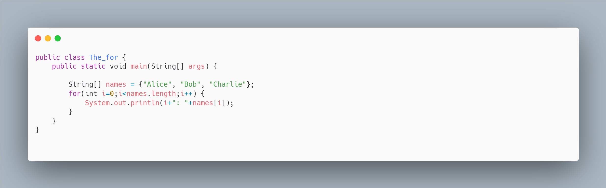
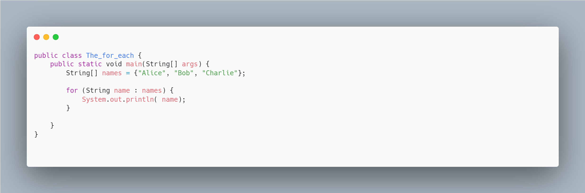
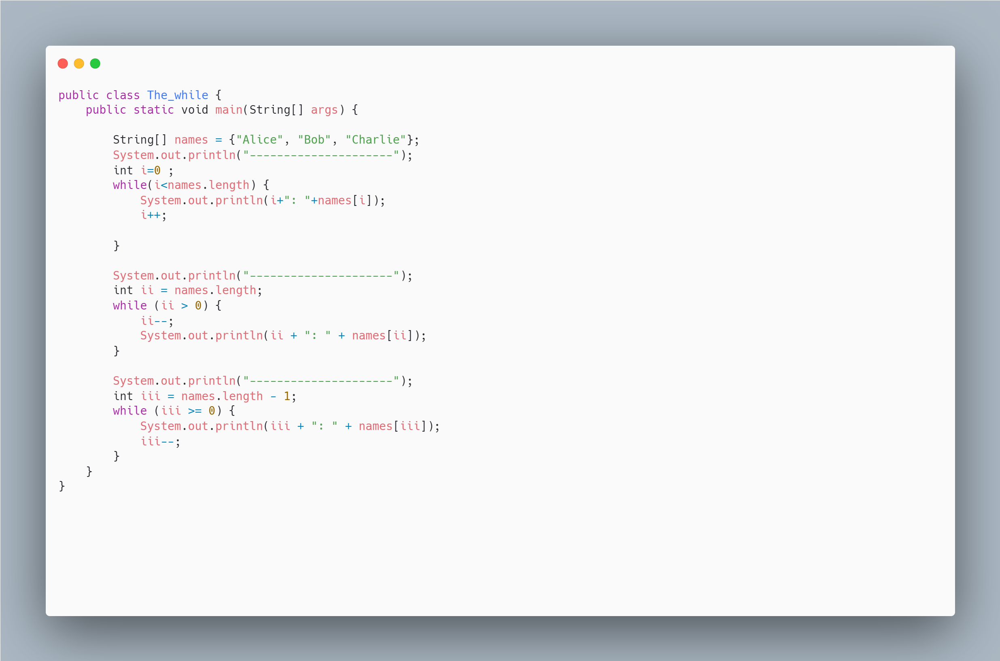
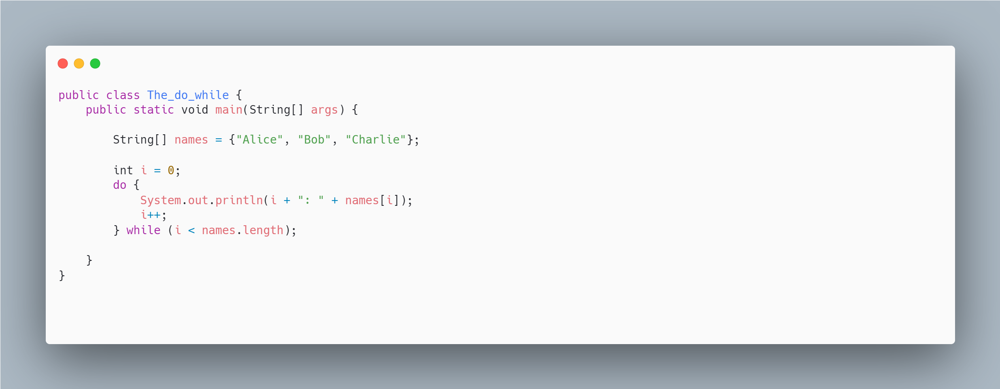
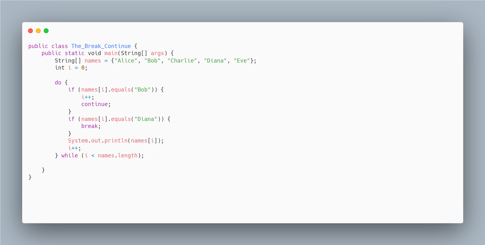
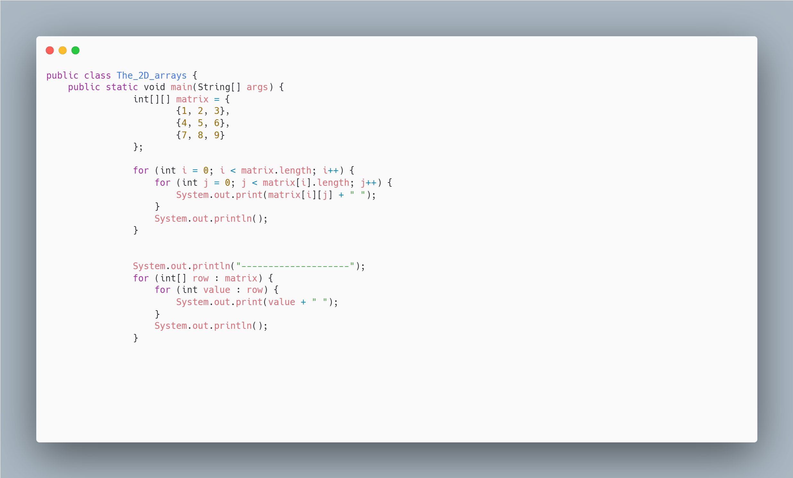
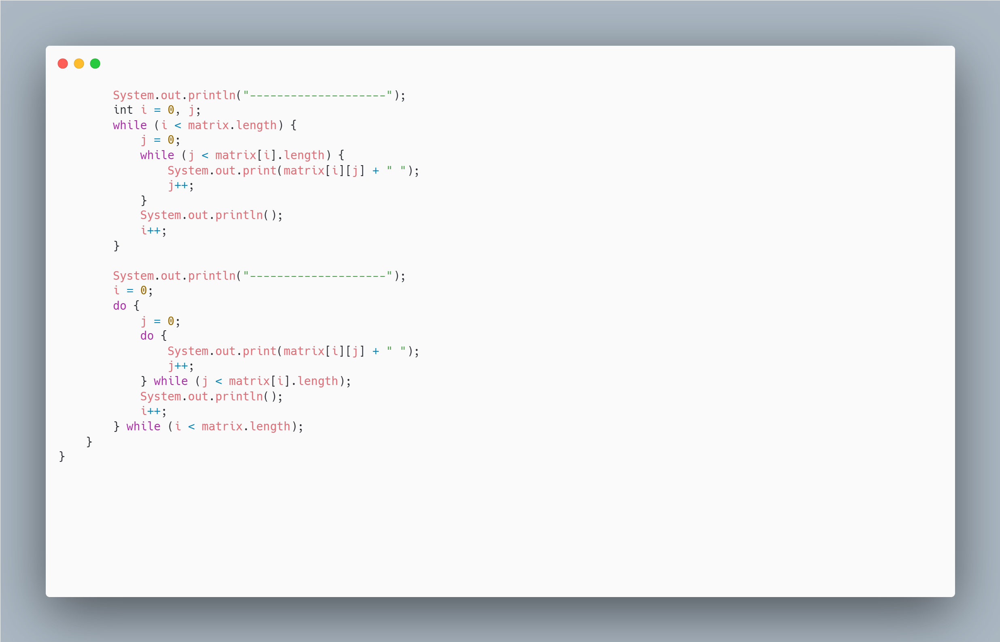
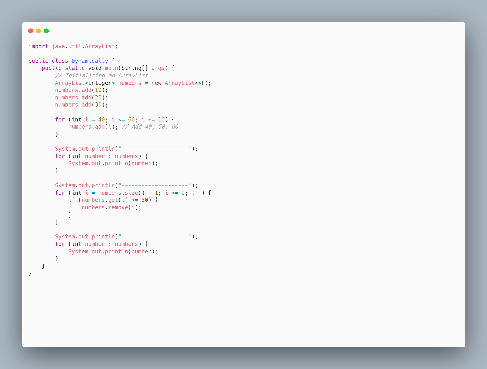
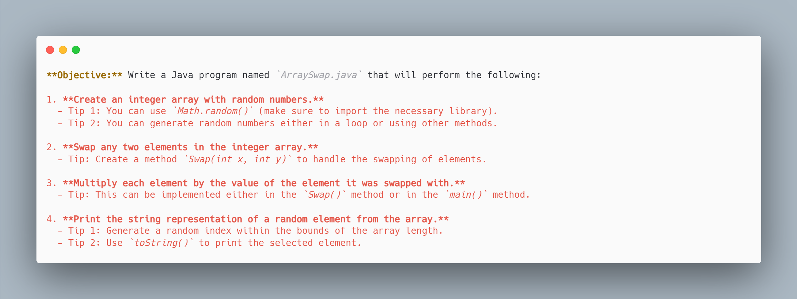

# Tutorial 1
## Goal : Learn Loops and iterate in a 2D Array  
<!-- toc -->

- [Examples](#examples)
  * [Loops : For & For-Each](#loops--for--for-each)
  * [Loops : While & Do While](#loops--while--do-while)
  * [Loops: Break & Continue](#loops-break--continue)
  * [Loops : Iterate in 2D array](#loops--iterate-in-2d-array)
  * [Using ArrayList and Looping](#using-arraylist-and-looping)

<!-- tocstop -->

# Examples

# Loops : For & For-Each

# Loops : While & Do While

# Loops: Break & Continue 

# Loops : Iterate in 2D array

# Using ArrayList and Looping 

# Task: Arrays and Loops - Swap

[//]: # ()
[//]: # (**Objective:** Write a Java program named `ArraySwap.java` that will perform the following:)

[//]: # ()
[//]: # (1. **Create an integer array with random numbers.**)

[//]: # (  - Tip 1: You can use `Math.random&#40;&#41;` &#40;make sure to import the necessary library&#41;.)

[//]: # (  - Tip 2: You can generate random numbers either in a loop or using other methods.)

[//]: # ()
[//]: # (2. **Swap any two elements in the integer array.**)

[//]: # (  - Tip: Create a method `Swap&#40;int x, int y&#41;` to handle the swapping of elements.)

[//]: # ()
[//]: # (3. **Multiply each element by the value of the element it was swapped with.**)

[//]: # (  - Tip: This can be implemented either in the `Swap&#40;&#41;` method or in the `main&#40;&#41;` method.)

[//]: # ()
[//]: # (4. **Print the string representation of a random element from the array.**)

[//]: # (  - Tip 1: Generate a random index within the bounds of the array length.)

[//]: # (  - Tip 2: Use `toString&#40;&#41;` to print the selected element.)
