# Tutorial 2
## Scope: 
  1. Java  Collections and their iterations 
  2. Complexity, Searching &Sorting

# Java Collections 

| Collection | Description | Key Methods |
|------------|-------------|-------------|
| **Map**    | Stores key-value pairs, no duplicate keys | `put(K key, V value)`, `get(Object key)`, `containsKey(Object key)`, `remove(Object key)`, `keySet()`, `values()` |
| **Set**    | Stores unique elements, no duplicates allowed | `add(E e)`, `remove(Object o)`, `contains(Object o)`, `size()`, `isEmpty()`, `clear()` |
| **List**   | Ordered collection, allows duplicates | `add(E e)`, `get(int index)`, `remove(int index)`, `size()`, `set(int index, E e)`, `contains(Object o)` |
| **Stack**  | LIFO (Last In, First Out) structure, extends `Vector` | `push(E e)`, `pop()`, `peek()`, `isEmpty()`, `search(Object o)` |
| **Queue**  | FIFO (First In, First Out) structure | `add(E e)`, `offer(E e)`, `remove()`, `poll()`, `peek()`, `isEmpty()` |

# Java interfaces 
| Collection | Common Implementations |
|------------|------------------------|
| **Map<K, V>** | `HashMap<K, V>`, `TreeMap<K, V>`, `LinkedHashMap<K, V>`, `Hashtable<K, V>` |
| **Set<E>** | `HashSet<E>`, `TreeSet<E>`, `LinkedHashSet<E>` |
| **List<E>** | `ArrayList<E>`, `LinkedList<E>`, `Vector<E>` |
| **Stack<E>** | `Stack<E>`, `ArrayDeque<E>` |
| **Queue<E>** | `LinkedList<E>`, `PriorityQueue<E>`, `ArrayDeque<E>` |

# Iterator 
## Why Use `Iterator` Instead of `for-each`?

1. **Removing Elements:**  
   `for-each` can’t remove items during iteration, but `Iterator` allows it using `remove()`.

2. **More Control:**  
   `Iterator` gives manual control with `hasNext()` and `next()`, allowing conditional iteration and early exit.

3. **Custom Logic:**  
   For complex iteration logic, `Iterator` is better than the simplicity of `for-each`.

4. **Legacy APIs:**  
   Some older APIs only provide `Iterator`, not `for-each`.

# Iterator - ForEach

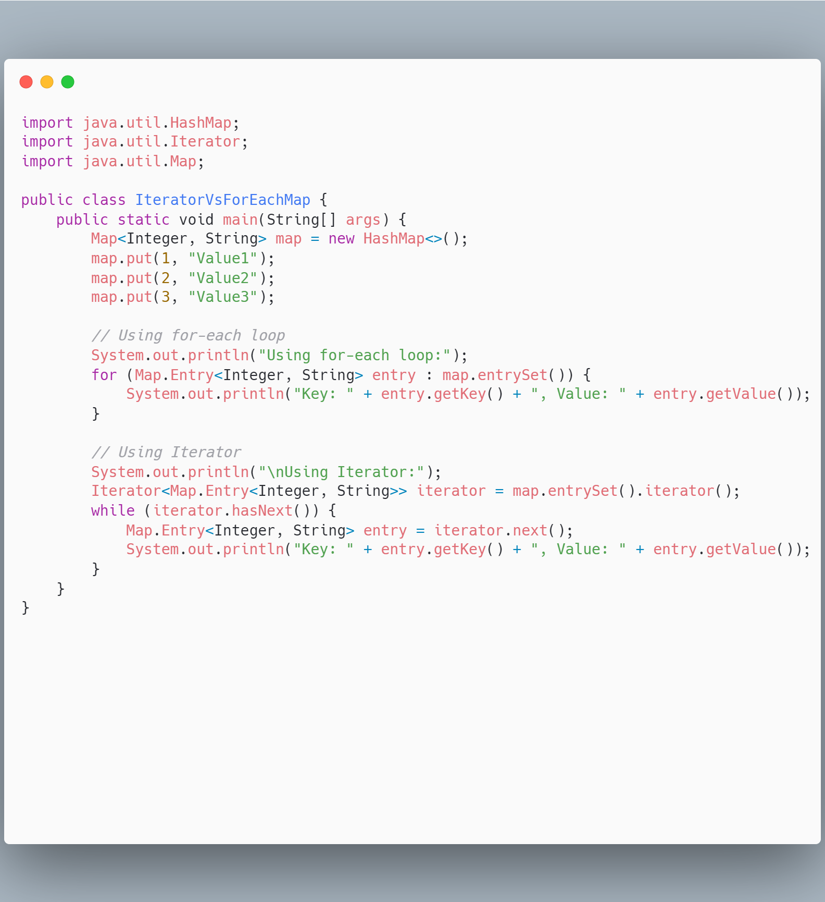

# Generics

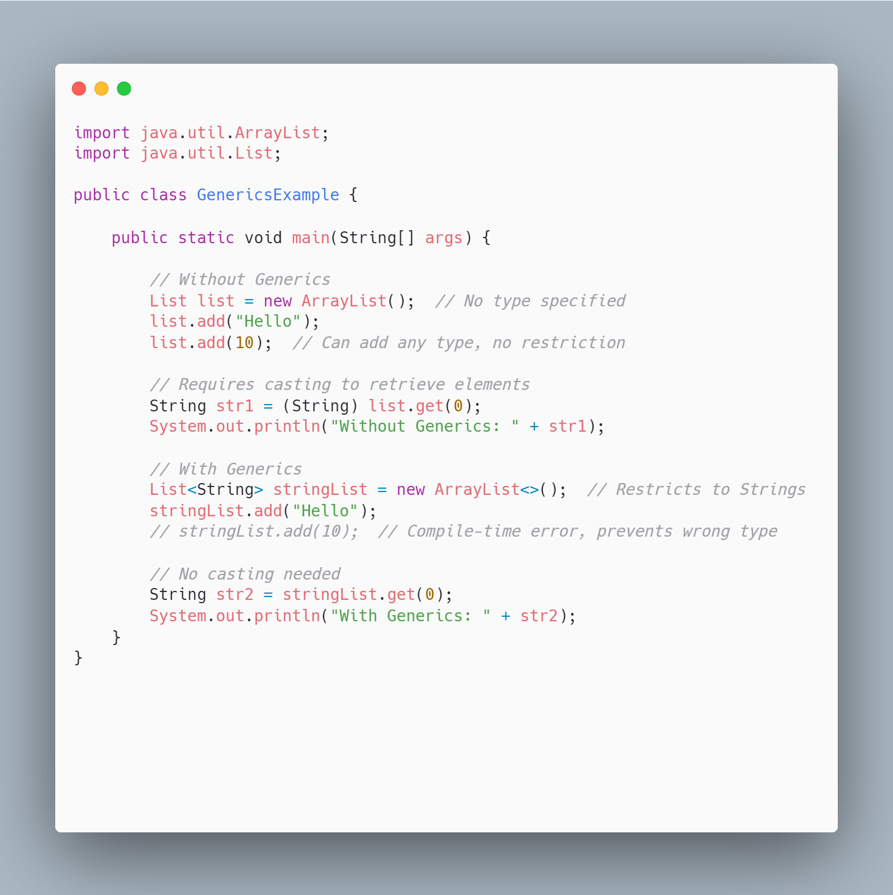

# Interface

An interface in Java defines a set of methods that a class must implement. It only provides method signatures, not their implementations.

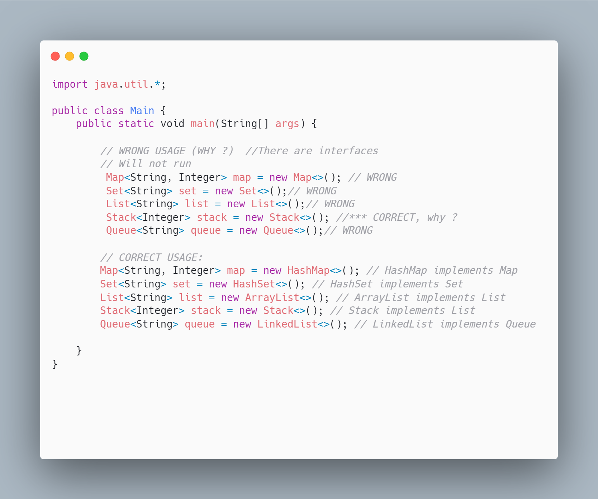

# Collaction Syntax

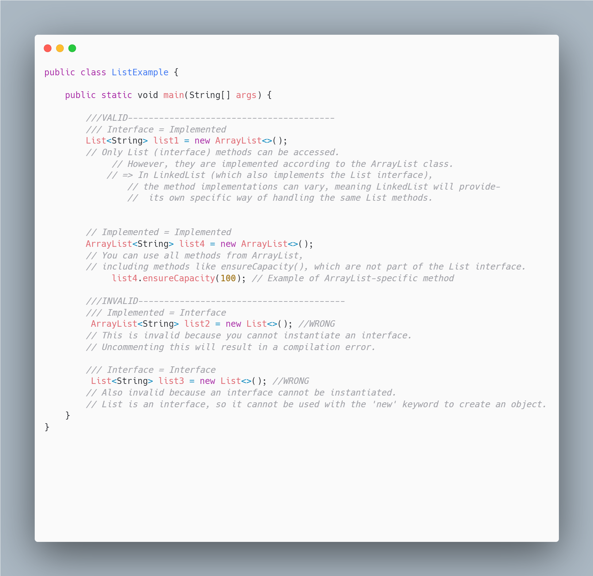

# Same method, different implementation 

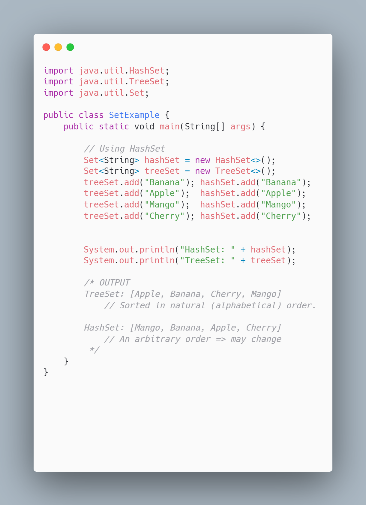

# Study for home :Collections

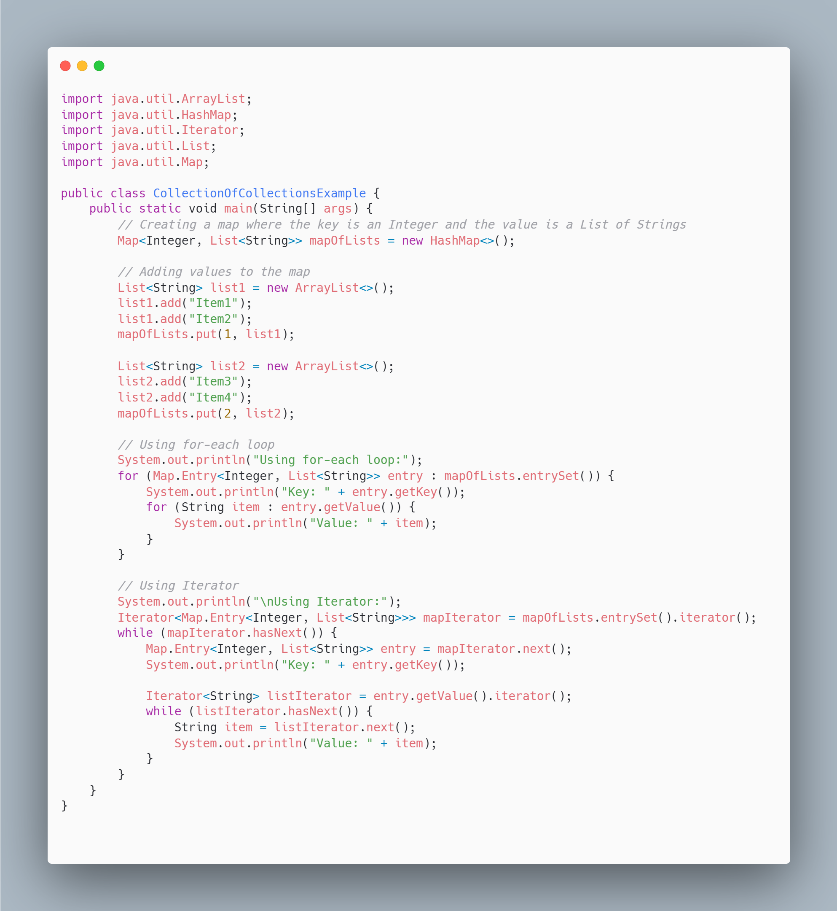

# Complexity 

- **Upper Bound (O)**: Maximum possible time.
- **Lower Bound (Ω)**: Minimum possible time.
- **Tight Bound (Θ)**: Average, typical time.

Image: [here](https://beginnersbook.com/2018/10/ds-asymptotic-notation/).

[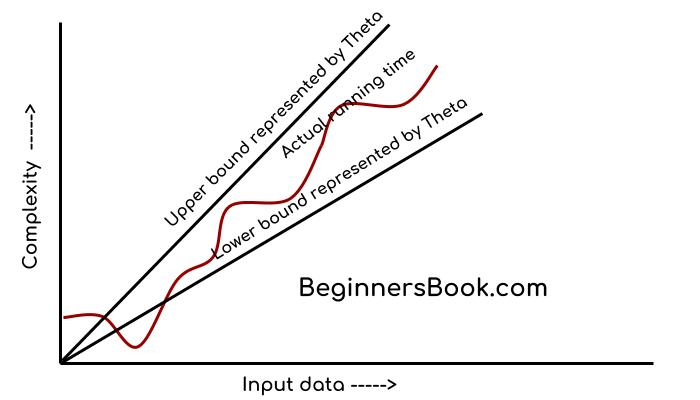](https://beginnersbook.com/2018/10/ds-asymptotic-notation/)

# 1. Constant Time (`O(1)`, `Ω(1)`, `Θ(1)`)

- **Upper Bound**: `O(1)`
    - This operation always takes the same amount of time, regardless of the array size. Accessing the first element is a direct memory access.

- **Lower Bound**: `Ω(1)`
    - The best case is the same: accessing the first element is constant time.

- **Average Case**: `Θ(1)`
    - The typical or average case also involves only one step, making the time constant.

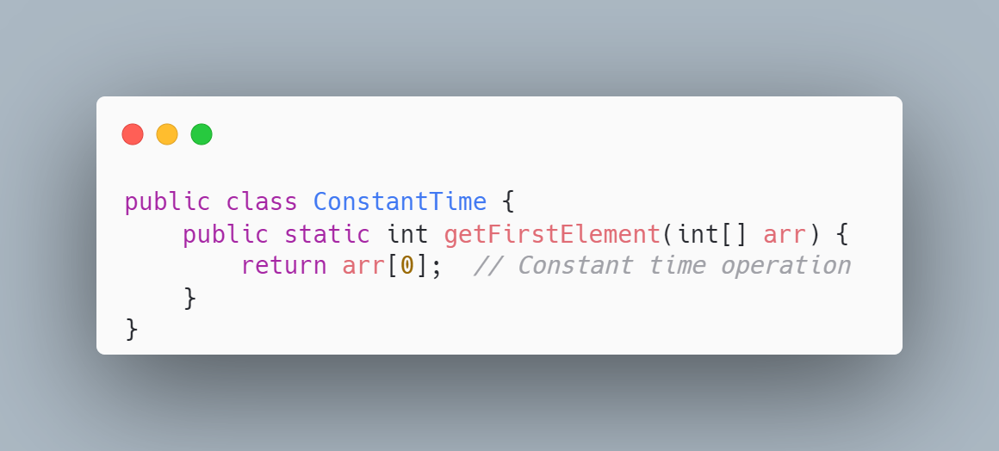

---

# 2. Binary Search (`O(log n)`, `Ω(1)`, `Θ(log n)`)

- **Upper Bound**: `O(log n)`
    - In the worst case, you keep halving the search space until it becomes small. Halving occurs `log n` times, so the maximum number of steps is proportional to `log n`.

- **Lower Bound**: `Ω(1)`
    - The best case occurs when the middle element is the target, so you find it in one step.

- **Average Case**: `Θ(log n)`
    - Typically, you’ll have to search through half the array repeatedly, which means logarithmic time is also the average case.

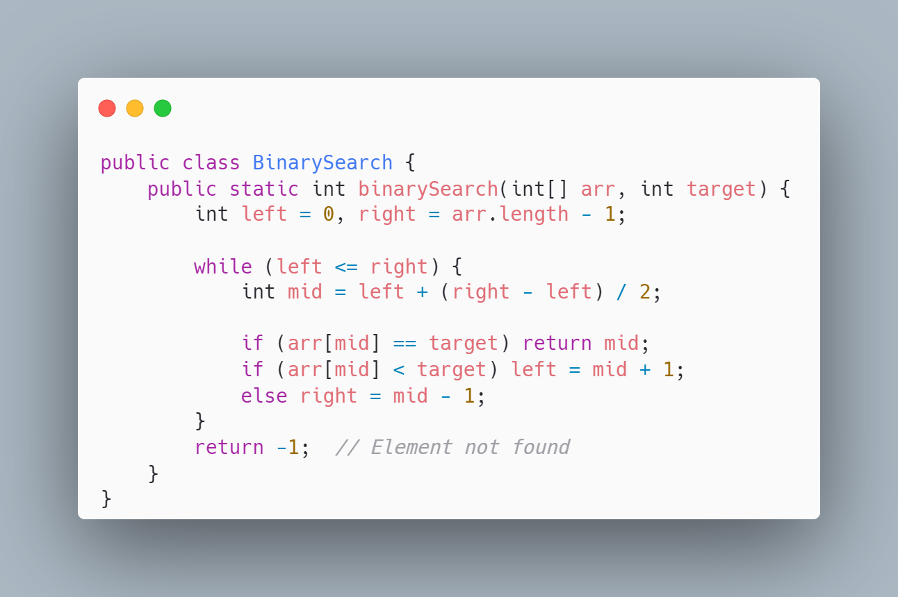

---

# 3. Linear Search (`O(n)`, `Ω(1)`, `Θ(n)`)

- **Upper Bound**: `O(n)`
    - In the worst case, the target element could be the last element or not present at all, so you’d have to check all `n` elements.

- **Lower Bound**: `Ω(1)`
    - The best case happens when the target is the first element, found in one comparison.

- **Average Case**: `Θ(n)`
    - On average, the target will be found halfway through the array, meaning you'll need to search through `n/2` elements, which simplifies to `n`.

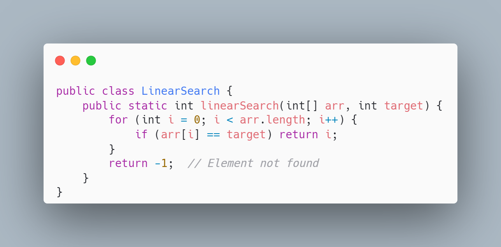

---

# 4. Merge Sort (`O(n log n)`, `Ω(n log n)`, `Θ(n log n)`)

- **Upper Bound**: `O(n log n)`
    - In the worst case, the array is split into halves `log n` times (because each division halves the size). Each level of recursion requires `n` comparisons to merge the arrays, so the time complexity becomes `n log n`.

- **Lower Bound**: `Ω(n log n)`
    - Even in the best case, the array must be split and merged the same way, resulting in `n log n` comparisons.

- **Average Case**: `Θ(n log n)`
    - Whether the input is random or ordered, the process of splitting and merging remains the same, meaning the average case is also `n log n`.

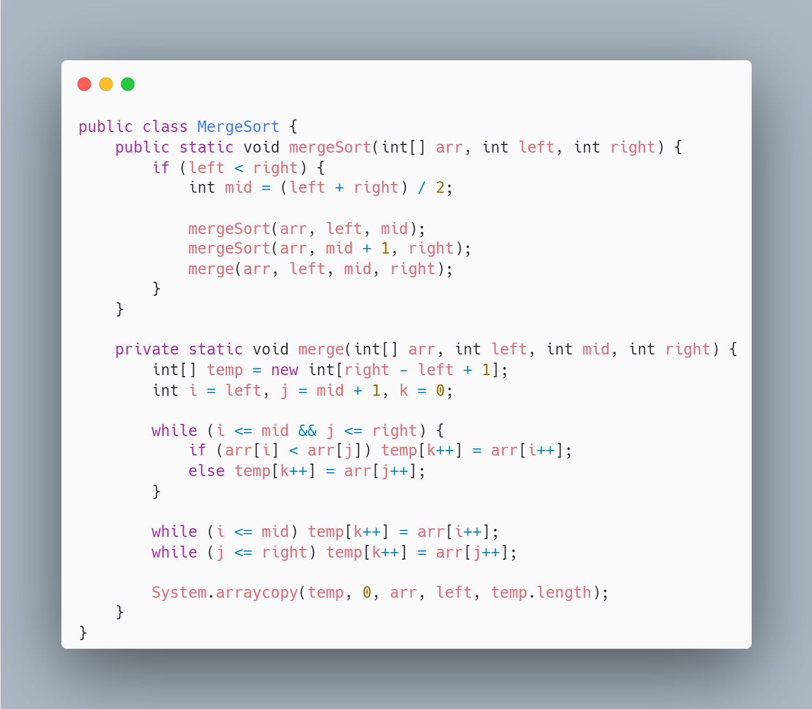

---

# 5. Bubble Sort (`O(n^2)`, `Ω(n)`, `Θ(n^2)`)

- **Upper Bound**: `O(n^2)`
    - In the worst case (when the array is in reverse order), the algorithm has to make `n` passes, each involving up to `n` comparisons, leading to `n^2` comparisons.

- **Lower Bound**: `Ω(n)`
    - In the best case (if the array is already sorted), a single pass through the array is enough to verify that no swaps are needed, resulting in `n` comparisons.

- **Average Case**: `Θ(n^2)`
    - Typically, the algorithm will need multiple passes and comparisons, which results in quadratic time complexity.

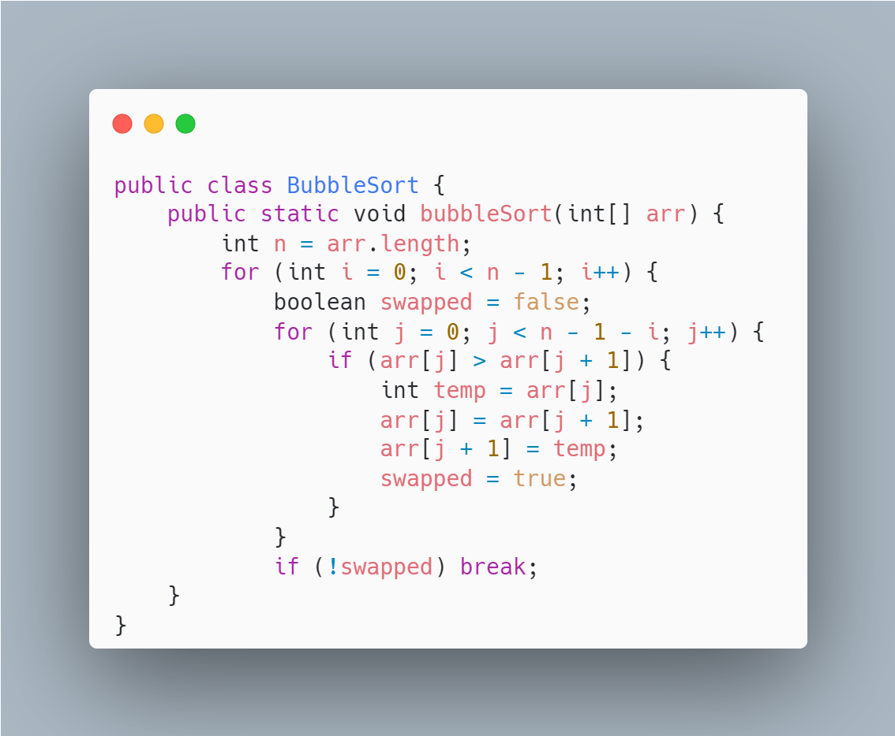

---

# 6. Fibonacci (Recursive) (`O(2^n)`, `Ω(2^n)`, `Θ(2^n)`)

- **Upper Bound**: `O(2^n)`
    - In the worst case, the recursion tree grows exponentially. Each call to `fibonacci` makes two recursive calls, leading to `2^n` growth.

- **Lower Bound**: `Ω(2^n)`
    - Even in the best case, the recursive structure does not change, and the number of function calls remains exponential.

- **Average Case**: `Θ(2^n)`
    - The average case behaves similarly to the worst case because the recursive structure leads to exponential growth in function calls in both cases.

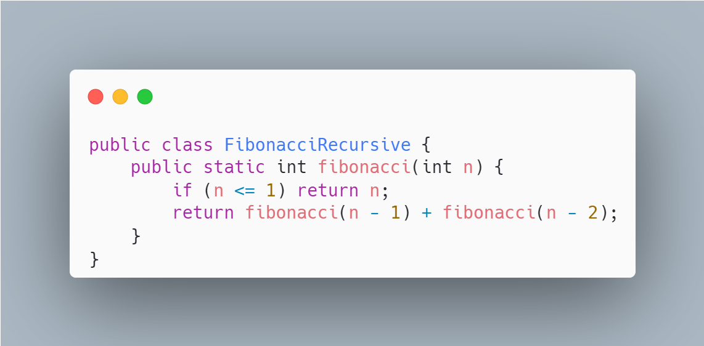
---

# Summary : The order of growth of functions

| **Algorithm**        | **Upper Bound (O)** | **Lower Bound (Ω)** | **Average Case (Θ)** |
|----------------------|---------------------|---------------------|----------------------|
| **Constant Time**     | `O(1)`              | `Ω(1)`              | `Θ(1)`               |
| **Binary Search**     | `O(log n)`          | `Ω(1)`              | `Θ(log n)`           |
| **Linear Search**     | `O(n)`              | `Ω(1)`              | `Θ(n)`               |
| **Merge Sort**        | `O(n log n)`        | `Ω(n log n)`        | `Θ(n log n)`         |
| **Bubble Sort**       | `O(n^2)`            | `Ω(n)`              | `Θ(n^2)`             |
| **Fibonacci (Recursive)** | `O(2^n)`       | `Ω(2^n)`            | `Θ(2^n)`             |

# Task (ArrayList):

### Exercise:
**Develop a program Main.java that will:**
- Create an ArrayList of 2 elements
- Add items to the ArrayList:
   - Try to insert strings (i.e., `String()` object) as well as integers (i.e., `Integer()`)
      - E.g., `list.add(new String("x"));`, `list.add(2, new Integer(10));`
   - And print the list
- Remove an item and print the list and check if the item you removed exists
   - Using `contains()` check if the list contains a specified element of your choice and print the output (tip: should be a Boolean `true` or `false`)
- Using the ListIterator, use a `while` loop and print every element of your list
   - Try also if you can do that using any other type of a loop (e.g., `for`)
- Create an object array from the ArrayList you have.

---

# Task (LinkedList):

### Exercise:
**Develop a program IntegerList.java that will create a LinkedList and add 4 Integer objects to it:**
- Print the size of the LinkedList
- Add integer objects at the beginning and the end of the LinkedList and print them
   - Tip: You might have to use `getFirst()` and `getLast()` methods of the LinkedList class — check the documentation.
- Remove the first and last elements of the list and print the list
- Remove the first instance of `Integer(1)` object and print the list
- Add a `String` named as “NewYork” and `Long` objects to the LinkedList and print the list
- Get the index of the "New York" String object and print it
- Remove the 3rd object in the LinkedList and print the list
- Set the value of the second item to `"one"` and print the list
- Clone the LinkedList object (tip: using `list.clone()`) and print it.

---

# Task (Set):

### Exercise:
**Develop a program Main.java that will create a LinkedList and add 4 Integer objects to it:**
- Print the size of the LinkedList
- Add integer objects at the beginning and the end of the LinkedList and print them
   - Tip: You might have to use `getFirst()` and `getLast()` methods of the LinkedList class — check the documentation.
- Remove the first and last elements of the list and print the list
- Remove the first instance of `Integer(1)` object and print the list
- Add a `String` named as “NewYork” and `Long` objects to the LinkedList and print the list
- Get the index of the "New York" String object and print it
- Remove the 3rd object in the LinkedList and print the list
- Set the value of the second item to `"one"` and print the list
- Clone the LinkedList object (tip: using `list.clone()`) and print it.

# Compare Collections (optional to read)
### 1. Map Interface Comparison

| Map            | HashMap         | TreeMap           | LinkedHashMap    | Hashtable         |
|----------------|-----------------|-------------------|------------------|-------------------|
| **Underlying Structure** | Hash table      | Red-Black tree    | Hash table + Linked List | Hash table         |
| **Ordering**   | No ordering      | Sorted based on natural ordering or comparator | Insertion-order   | No ordering        |
| **Null Keys/Values** | One null key, multiple null values | No null keys, multiple null values | One null key, multiple null values | No null keys, no null values |
| **Thread Safety** | Not synchronized | Not synchronized  | Not synchronized | Synchronized      |
| **Performance** | O(1) average for get/put | O(log n) for get/put | O(1) average for get/put | O(1) average for get/put |
| **Use Case**   | Fast access with no ordering | Sorted map needed | Fast access + insertion order needed | Thread-safe map needed |

### 2. Set Interface Comparison

| Set            | HashSet         | TreeSet           | LinkedHashSet    |
|----------------|-----------------|-------------------|------------------|
| **Underlying Structure** | Hash table      | Red-Black tree    | Hash table + Linked List |
| **Ordering**   | No ordering      | Sorted based on natural ordering or comparator | Insertion-order   |
| **Null Values**| Allows one null element | Does not allow null elements | Allows one null element |
| **Thread Safety** | Not synchronized | Not synchronized  | Not synchronized |
| **Performance** | O(1) average for add, remove, contains | O(log n) for add, remove, contains | O(1) average for add, remove, contains |
| **Use Case**   | Fast set operations, no duplicates | Sorted set needed | Fast set operations + insertion order |

### 3. List Interface Comparison

| List           | ArrayList       | LinkedList        | Vector           |
|----------------|-----------------|-------------------|------------------|
| **Underlying Structure** | Dynamic array   | Doubly linked list | Dynamic array     |
| **Random Access** | Fast (O(1))    | Slow (O(n))       | Fast (O(1))       |
| **Insertion/Deletion** | Slow (O(n)) in the middle | Fast (O(1) at the beginning and end) | Slow (O(n)) in the middle |
| **Thread Safety** | Not synchronized | Not synchronized  | Synchronized      |
| **Growth Policy** | Grows by 50% when full | N/A (linked structure) | Grows by 100% (doubles) |
| **Use Case**   | Frequent access by index, few insertions | Frequent insertions/removals | Thread-safe list needed |

### 4. Stack Interface Comparison

| Stack          | Stack           | ArrayDeque        |
|----------------|-----------------|-------------------|
| **Underlying Structure** | Dynamic array (extends Vector) | Resizable array  |
| **Performance** | O(1) for push, pop | O(1) for push, pop  |
| **Thread Safety** | Synchronized    | Not synchronized   |
| **Additional Features** | Extends Vector, allows legacy methods | Preferred modern stack implementation |
| **Use Case**   | Thread-safe stack, legacy code | Preferred for modern LIFO stack usage |

### 5. Queue Interface Comparison

| Queue          | LinkedList      | PriorityQueue     | ArrayDeque       |
|----------------|-----------------|-------------------|------------------|
| **Underlying Structure** | Doubly linked list | Binary heap       | Resizable array  |
| **Ordering**   | Insertion-order | Natural ordering or custom comparator | Insertion-order   |
| **Null Elements** | Allows null     | Does not allow null | Does not allow null |
| **Thread Safety** | Not synchronized | Not synchronized  | Not synchronized |
| **Use Case**   | General-purpose queue, also a deque | Priority-based queue | High-performance general-purpose queue |
