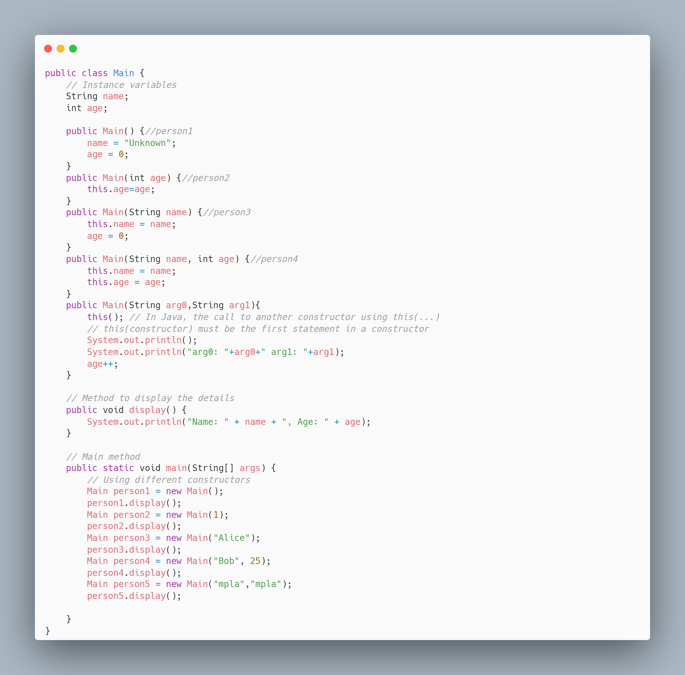
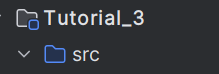

# Tutorial 3 
## Goals: 
- Complexity & Sorting 
  - Insertion Sort 
  - Quick sort 
- OPP Intro


# Insertion Sort (`O(n^2)`, `Ω(n)`, `Θ(n^2)`)

- **Upper Bound**: `O(n^2)`
    - In the worst case, the array is sorted in reverse order, so every new element has to be compared to all previously sorted elements, resulting in `n^2` comparisons.

- **Lower Bound**: `Ω(n)`
    - In the best case, the array is already sorted, and each element only needs to be compared once, resulting in a linear time of `n`.

- **Average Case**: `Θ(n^2)`
    - On average, the algorithm performs a number of comparisons close to quadratic as most elements will require shifting through multiple comparisons, especially for larger arrays.


# Quick Sort (`O(n^2)`, `Ω(n log n)`, `Θ(n log n)`)

- **Upper Bound**: `O(n^2)`
    - In the worst case, the algorithm will pick the smallest or largest element as the pivot in each iteration, leading to unbalanced partitions. This results in quadratic time complexity, `O(n^2)`.

- **Lower Bound**: `Ω(n log n)`
    - In the best case, the pivot divides the list into two equal-sized sub-lists, resulting in logarithmic depth and `n` comparisons per level. Thus, the time complexity is `O(n log n)`.

- **Average Case**: `Θ(n log n)`
    - On average, Quick Sort performs well because the pivot tends to split the list into fairly balanced partitions, making the expected time complexity `Θ(n log n)`. It's suitable for large datasets.


# Create Modules 

## Right click on Project's name
### New -> Module 


## Give a Name and specify the SDK 


## Then the new Module file looks like: 


# Class 




# Create Packages 

1. Right click on src folder 
   - New -> Package


2. Create the packages and sub-packages of image




# Example 1: Building & Department package


# Example 1: University  package


# Example 1: Main


# Next Example 


# Task 

## Exercise: ATM and Customer Interaction with BankAccount
Overview
This exercise simulates a real-world banking system where a Customer interacts with their BankAccount through an ATM. 
Only the ATM can modify the balance, allowing Customer requests for deposits and withdrawals while maintaining controlled access to sensitive account data.

Objectives
Understand the concept of encapsulation and controlled access using access modifiers (public, private, package-private).
Implement a system where only specific classes (ATM) can modify sensitive data (balance).
Demonstrate interaction between multiple classes using method calls and access control.

```bash 
ATMExampleProject
└── src
    ├── mainPackage
    │   └── Main.java
    ├── customerPackage
    │   └── Customer.java
    └── bankPackage
        ├── BankAccount.java
        └── ATM.java
```
** Tip: look at Teams for the structure( optional)