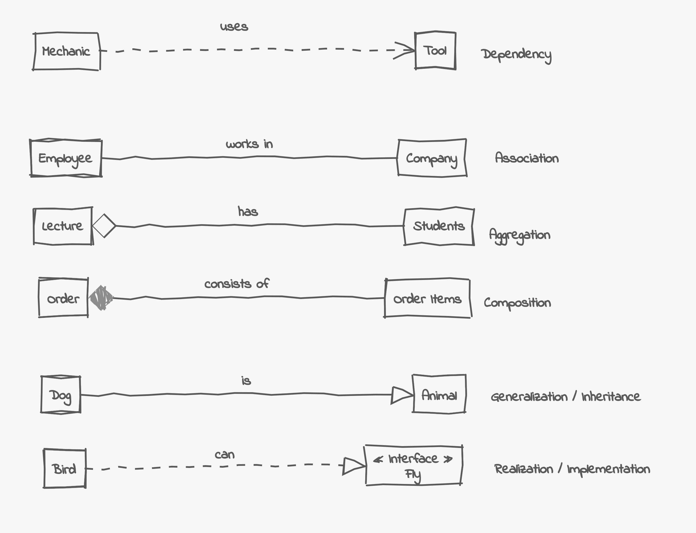

# Goal 
- UML 
  - Class Diagram 
  - Use Case Diagram 

# UML 
- UML (Unified Modeling Language) is a visual language used to model and design object-oriented systems.
- Helps developers visualize the structure and interactions of system components before coding.
  - ** Use `Drawio`: https://drawio-app.com/blog/uml-class-diagrams-in-draw-io/

# Common UML diagrams 

- Structure Diagrams
  - Focus: Represent the static structure of the system.
  - Purpose: Show how components, classes, or objects are organized.
    - Examples:
      - Class Diagram: Represents classes, attributes, methods, and relationships.
      - Component Diagram: Shows the organization of components in the system.
      - Object Diagram: Displays a snapshot of objects and their relationships at a specific moment.

- Behavior Diagrams
  - Focus: Represent the dynamic behavior of the system.
  - Purpose: Show how objects interact, change states, and collaborate over time.
    - Examples:
      - Use Case Diagram: Depicts system functionality from a user's perspective.
      - Sequence Diagram: Shows object interactions over time.
      - Activity Diagram: Illustrates workflows or processes.

- Further details and image link : https://www.geeksforgeeks.org/unified-modeling-language-uml-introduction/

# Class Diagram: 

# Class Diagram : Components  
- Focuses on:
  - Classes: Blueprint of objects.
  - Attributes: Properties of a class.
  - Methods: Functions that define behavior.
  - Relationships: Inheritance, association, aggregation, and composition.

# Class Diagram : Relationships

1. Dependency (uses)
     *  Dotted arrow
     *  Pointing from the dependent class to the class it depends on.
     * Dog uses Food Bowl
     * The Dog temporarily depends on the Food Bowl when eating, but it does not rely on the bowl all the time.
2. Association (works in)
     * Solid line 
     * Interaction 
     * Dog lives with(works in) Owner
3. Aggregation (has)
     *  Hollow diamond
     *  Connecting the aggregate (whole) to its parts.
     *  The part can exist independently of the whole
     * `Dog` has `Toys`
4. Composition (consists of)
     *  Filled diamond
     * The part cannot exist independently of the whole
     * `Dog` consists of `Legs`
5. Generalization/Inheritance (is) 
     * Solid line with an empty arrowhead 
     * pointing from the child class to the parent class.
     * (child) inherits properties and behavior from another class (parent).
     * `Dog` is  `Animal`
6. Realization/ Implementation (can)
     * Dotted line with an empty arrowhead
     * From the implementing class to the interface
     * `Dog` can `Bark` (Bark as an interface)

** more details : https://www.umlboard.com/docs/relations/

# Use Case  Diagram 
- Focuses on:
  - Actors: External entities (users, systems).
  - Use Cases: Functions or services the system provides.
  - System Boundary: Defines the scope of the system.

