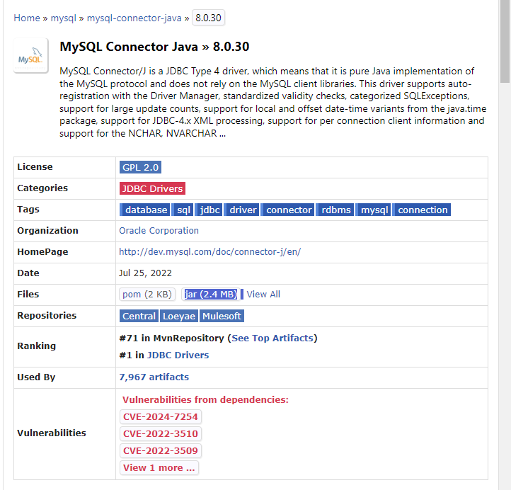
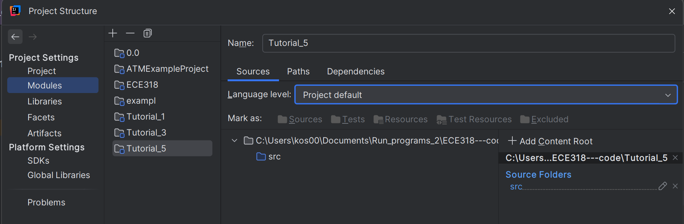

# Goal 

- Driver
- JDBC 
- Database Tool 
- MySQL 

# Mysql install 
- `https://dev.mysql.com/downloads/installer/`
** you dont have to login : there is a `No thanks, just start my download.` option 

# Driver 
`https://mvnrepository.com/artifact/mysql/mysql-connector-java/8.0.30`
- at the table, in the row `Files` click on jar and download it in the  location you have all your ECE318 Projects

- to enable Connector 
  - in InteliJ 
    - FIle-> Project Structure  -> Select  Module (e.g. Tutorial_5) 
    -  Select Dependencies tab -> Click  (+) and select `Jar or Directories`
      - find and select `mysql-connector-java-8.0.30.jar` 
      - Click `apply` and then  `OK` 

** Useful link : `https://www.youtube.com/watch?v=AHFBPxWebFQ` minutes :7:29 - end

# Database Tool

- View -> Tool Windows -> Database
- In database window -> click (+) -> Data Source -> MySQL
- in tab data sources change the user :  to root -  then in Driver tab  click (+) -> and in Driver files click (+) and upload the location of `mysql-connector-java-8.0.30.jar`

** or `C:\Users\<username>\AppData\Roaming\JetBrains\IntelliJIdea2024.2\jdbc-drivers\MySQL ConnectorJ\8.2.0\com\mysql\mysql-connector-j\8.2.0\mysql-connector-j-8.2.0.jar` 
# JDBC

* Steps 
  - Register the driver class
  - Create connection 
    - Create statement 
    - Execute queries 
  - Close connection

# MySQL 

